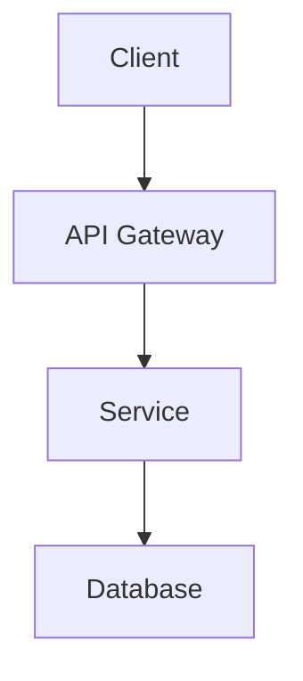

# RFC: {{title}}

| Field | Value |
|-------|-------|
| **Status** | Draft / In Review / Accepted / Rejected |
| **Author** | |
| **Created** | {{date}} |
| **Reviewers** | |

## Problem Statement

What problem are we solving? Why now?

## Proposal

### Overview

High-level description of the solution.

### Architecture



### API / Interface

```typescript
// Key interfaces here
```

## Alternatives Considered

| Option | Pros | Cons |
|--------|------|------|
| Current proposal | | |
| Alternative A | | |
| Do nothing | | |

## Risks & Mitigations

- **Risk:** 
  - **Mitigation:** 

## Success Criteria

- [ ] 
- [ ] 

## Open Questions

- [ ] 
