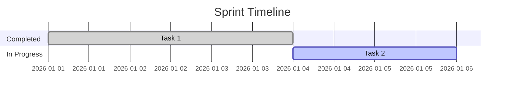

# Sprint Retro — Sprint {{sprint}}

**Date:** {{date}}  
**Team:** 

## 🟢 What went well

- 

## 🔴 What didn't go well

- 

## 💡 Ideas / experiments to try

- 

## ✅ Action Items

| Action | Owner | Due |
|--------|-------|-----|
|        |       |     |

## 📊 Sprint Metrics

